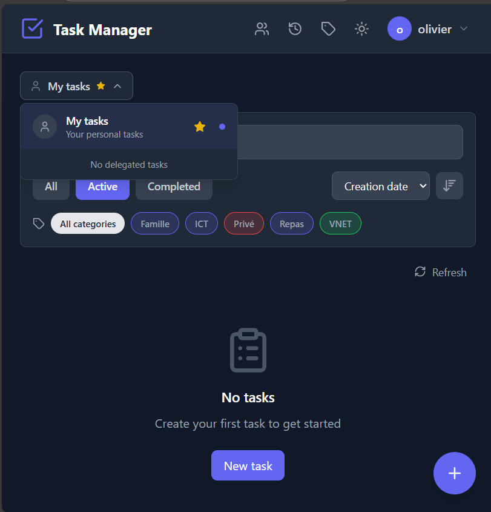
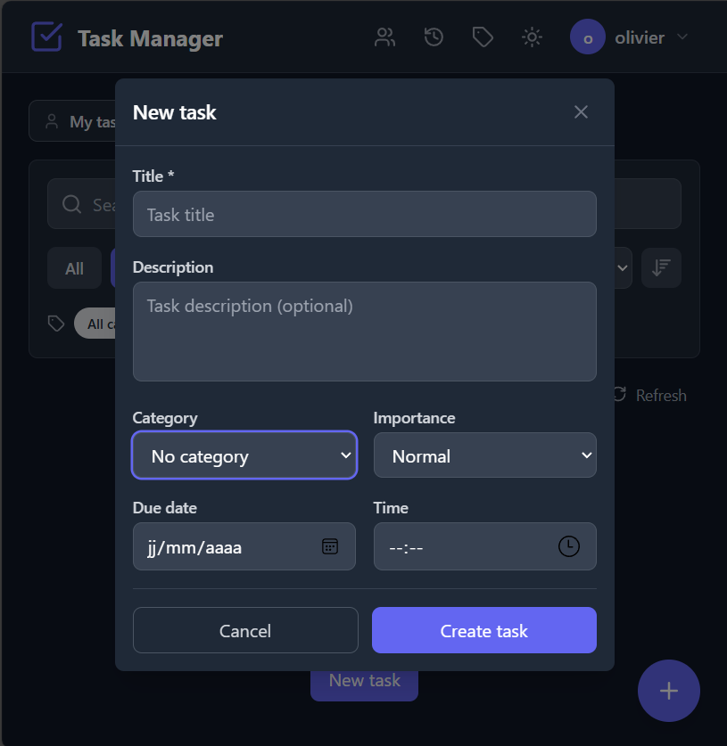
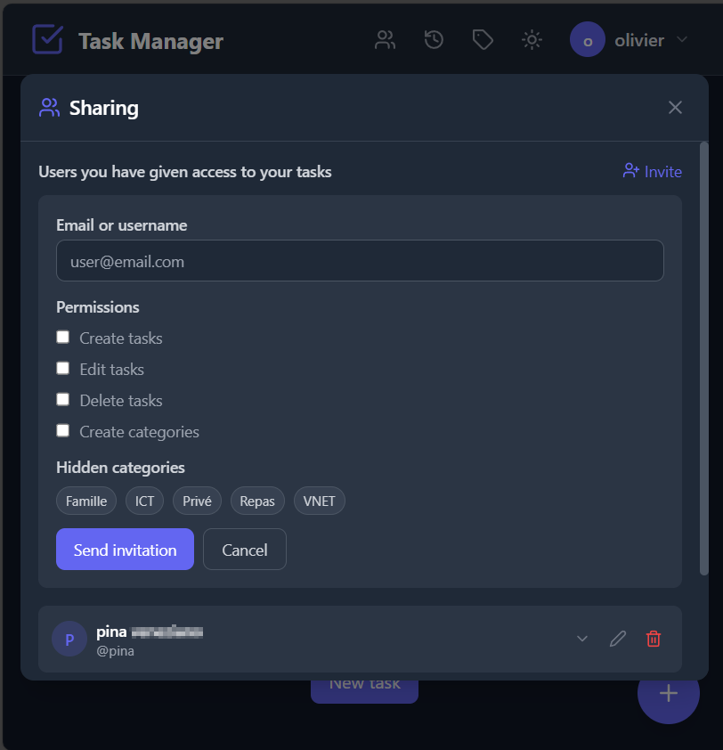
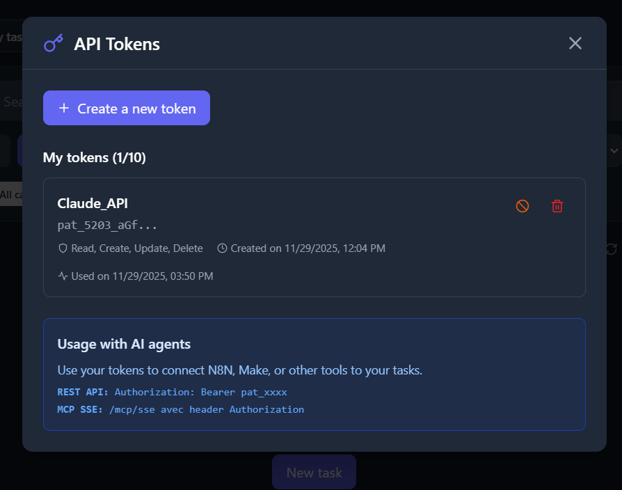

# Task Manager v2.0

> **Disponible en :** 🇬🇧 [English](README.md) | 🇫🇷 [Français](README.fr.md)

Application de gestion de tâches multi-utilisateurs avec interface moderne, système de délégation et panneau d'administration.

**Intègre un serveur MCP (Model Context Protocol)** permettant aux agents IA (Claude Desktop, N8N, etc.) de gérer vos tâches de manière autonome.

<p align="center">
  
  
  
  
</p>

## Fonctionnalités

### Pour les utilisateurs
- **Authentification** : Inscription et connexion (email ou nom d'utilisateur)
- **Gestion des tâches** : Créer, modifier, supprimer, marquer comme complétées
- **Catégories** : Organiser les tâches avec des catégories colorées personnalisées
- **Filtres avancés** : Par statut, priorité, catégorie + recherche textuelle
- **Tri** : Par date d'échéance, priorité ou date de création
- **Export** : Télécharger ses tâches en JSON ou XML
- **Import** : Importer des tâches depuis un fichier JSON ou XML avec gestion des doublons (Nouveau v0.7)
- **Paramètres** : Modifier son profil, email et mot de passe
- **Thème** : Mode clair / Mode sombre
- **Multilingue** : Interface en français et anglais (Nouveau v0.8)

### Délégation de tâches (Nouveau v2.0)
- **Partage** : Inviter d'autres utilisateurs à gérer ses tâches
- **Permissions granulaires** : Définir les droits (créer, modifier, supprimer, catégories)
- **Catégories masquées** : Cacher certaines catégories aux délégués
- **Contexte par défaut** : Choisir quel contexte afficher au login (ses tâches ou celles d'un owner)
- **Journal d'activité** : Suivre les actions effectuées par les délégués

### Pour les administrateurs
- **Dashboard** : Statistiques globales (utilisateurs, tâches, taux de complétion)
- **Gestion utilisateurs** : Activer/désactiver, supprimer, promouvoir admin
- **Actions avancées** : Changer le mot de passe d'un utilisateur, exporter/importer ses tâches
- **Accès API** : Activer/désactiver l'accès API par utilisateur

### Intégration API & MCP (Nouveau v0.6)
- **Personal Access Tokens (PAT)** : Créer des tokens API avec permissions granulaires
- **Serveur MCP** : Intégration native avec les agents IA (N8N, Claude Desktop, etc.)
- **HTTP Streamable** : Nouveau standard MCP (recommandé)
- **SSE Transport** : Support legacy pour rétrocompatibilité
- **Outils MCP** : tasks_list, tasks_create, tasks_update, tasks_complete, categories_list, etc.

## Technologies

| Composant | Technologie |
|-----------|-------------|
| Frontend | React 18, Vite, Tailwind CSS, Lucide Icons |
| Backend | Node.js, Express.js, Prisma ORM |
| Base de données | PostgreSQL 15 |
| Authentification | JWT, bcrypt, PAT (Personal Access Tokens) |
| MCP Server | @modelcontextprotocol/sdk v1.23.0 |
| Conteneurisation | Docker, Docker Compose |
| Serveur web | Nginx (production) |

## Prérequis

- Docker et Docker Compose installés
- Ports disponibles : 80 (frontend), 3000 (API), 5432 (PostgreSQL)

## Installation

### Option 1 : Développement local

#### 1. Cloner le projet

```bash
git clone <repository-url>
cd TaskManager
```

#### 2. Configuration de l'environnement

Créer le fichier `.env` à la racine :

```env
# Database
DB_USER=taskmanager_user
DB_PASSWORD=SecurePassword123!
DB_NAME=taskmanager_db
DATABASE_URL=postgresql://taskmanager_user:SecurePassword123!@db:5432/taskmanager_db

# Backend
NODE_ENV=development
JWT_SECRET=change_this_super_secret_key_in_production
JWT_EXPIRES_IN=7d
PORT=3000

# Frontend
VITE_API_URL=/api/v1
```

#### 3. Lancer l'application

```bash
docker-compose up --build -d
```

#### 4. Accéder à l'application

- **Application** : http://localhost
- **API** : http://localhost:3000/api/v1
- **Admin** : http://localhost/admin/login

### Option 2 : Déploiement Synology/Portainer

Utiliser le fichier `docker-compose.synology.yml` qui contient :
- Images Docker pré-construites depuis Docker Hub (`lordbadack/taskmanager-*:0.8`)
- Mots de passe et secrets générés
- Migrations automatiques au démarrage
- Seed automatique de l'admin
- Support MCP (HTTP Streamable + SSE)

## Images Docker Hub

| Image | Tags |
|-------|------|
| `lordbadack/taskmanager-backend` | `0.8`, `0.7`, `0.6` |
| `lordbadack/taskmanager-frontend` | `0.8`, `0.7`, `0.6` |

## Compte administrateur par défaut

| Champ | Valeur |
|-------|--------|
| Username | `admin` |
| Password | `admin` |

> **Important** : Le mot de passe doit être changé à la première connexion.

## Structure du projet

```
TaskManager/
├── backend/
│   ├── prisma/
│   │   ├── schema.prisma      # Modèle de données
│   │   ├── seed.js            # Création admin par défaut
│   │   └── migrations/        # Migrations SQL
│   ├── src/
│   │   ├── controllers/       # Logique métier
│   │   ├── routes/            # Définition des routes API
│   │   ├── middleware/        # Middlewares (auth, admin)
│   │   └── index.js           # Point d'entrée
│   ├── Dockerfile
│   └── package.json
├── frontend/
│   ├── src/
│   │   ├── components/        # Composants réutilisables
│   │   ├── pages/             # Pages principales
│   │   ├── services/          # Appels API
│   │   ├── hooks/             # Hooks React personnalisés
│   │   ├── App.jsx
│   │   └── main.jsx
│   ├── Dockerfile
│   ├── nginx.conf
│   └── package.json
├── mcp-bridge/                # Bridge MCP pour Claude Desktop
│   ├── index.js               # Bridge stdio → HTTP
│   └── package.json
├── docs/
│   └── API-MCP-INTEGRATION.md # Documentation API & MCP
├── docker-compose.yml         # Développement local
├── docker-compose.synology.yml # Déploiement Synology/Portainer
├── CHANGELOG.md
└── README.md
```

## Référence API

### Authentification

| Méthode | Endpoint | Description |
|---------|----------|-------------|
| POST | `/api/v1/auth/register` | Inscription |
| POST | `/api/v1/auth/login` | Connexion |
| GET | `/api/v1/auth/me` | Profil utilisateur |
| PATCH | `/api/v1/auth/profile` | Modifier profil |
| PATCH | `/api/v1/auth/email` | Modifier email |
| PATCH | `/api/v1/auth/password` | Modifier mot de passe |
| PATCH | `/api/v1/auth/default-context` | Définir contexte par défaut |

### Tâches

| Méthode | Endpoint | Description |
|---------|----------|-------------|
| GET | `/api/v1/tasks` | Liste des tâches |
| POST | `/api/v1/tasks` | Créer une tâche |
| PUT | `/api/v1/tasks/:id` | Modifier une tâche |
| DELETE | `/api/v1/tasks/:id` | Supprimer une tâche |
| PATCH | `/api/v1/tasks/:id/complete` | Marquer comme terminée |
| PATCH | `/api/v1/tasks/:id/reopen` | Réouvrir une tâche |
| GET | `/api/v1/tasks/export` | Exporter les tâches |

**Paramètres de filtrage (GET /tasks)** :
- `status` : `all` | `active` | `completed`
- `priority` : `low` | `medium` | `high`
- `categoryId` : UUID de la catégorie
- `search` : Recherche textuelle
- `sortBy` : `dueDate` | `priority` | `created_at`
- `sortOrder` : `asc` | `desc`
- `ownerId` : UUID du propriétaire (pour délégation)

### Catégories

| Méthode | Endpoint | Description |
|---------|----------|-------------|
| GET | `/api/v1/categories` | Liste des catégories |
| POST | `/api/v1/categories` | Créer une catégorie |
| PUT | `/api/v1/categories/:id` | Modifier une catégorie |
| DELETE | `/api/v1/categories/:id` | Supprimer une catégorie |

### Délégations

| Méthode | Endpoint | Description |
|---------|----------|-------------|
| GET | `/api/v1/delegations` | Liste des délégations (données et reçues) |
| POST | `/api/v1/delegations` | Créer une invitation |
| PATCH | `/api/v1/delegations/:id` | Modifier les permissions |
| DELETE | `/api/v1/delegations/:id` | Supprimer une délégation |
| POST | `/api/v1/delegations/:id/accept` | Accepter une invitation |
| POST | `/api/v1/delegations/:id/reject` | Refuser une invitation |
| POST | `/api/v1/delegations/:id/leave` | Quitter une délégation |
| GET | `/api/v1/delegations/search-users` | Rechercher des utilisateurs |

### Journal d'activité

| Méthode | Endpoint | Description |
|---------|----------|-------------|
| GET | `/api/v1/activity` | Historique des actions |

### Administration (requiert rôle admin)

| Méthode | Endpoint | Description |
|---------|----------|-------------|
| GET | `/api/v1/admin/stats` | Statistiques globales |
| GET | `/api/v1/admin/users` | Liste des utilisateurs |
| GET | `/api/v1/admin/users/:id` | Détail d'un utilisateur |
| PATCH | `/api/v1/admin/users/:id` | Modifier rôle/statut/accès API |
| PATCH | `/api/v1/admin/users/:id/password` | Changer mot de passe |
| DELETE | `/api/v1/admin/users/:id` | Supprimer utilisateur |
| GET | `/api/v1/admin/users/:id/export` | Exporter tâches utilisateur |

### Tokens API (Personal Access Tokens)

| Méthode | Endpoint | Description |
|---------|----------|-------------|
| GET | `/api/v1/tokens` | Liste des tokens de l'utilisateur |
| POST | `/api/v1/tokens` | Créer un nouveau token |
| DELETE | `/api/v1/tokens/:id` | Révoquer un token |

**Permissions disponibles** :
- `canReadTasks` - Lire les tâches
- `canCreateTasks` - Créer des tâches
- `canUpdateTasks` - Modifier des tâches
- `canDeleteTasks` - Supprimer des tâches
- `canReadCategories` - Lire les catégories
- `canCreateCategories` - Créer des catégories

### Serveur MCP

| Méthode | Endpoint | Description |
|---------|----------|-------------|
| POST | `/mcp` | HTTP Streamable - requêtes JSON-RPC |
| GET | `/mcp` | HTTP Streamable - stream SSE (stateful) |
| DELETE | `/mcp` | HTTP Streamable - fermer session |
| GET | `/mcp/sse` | SSE legacy - connexion |
| POST | `/mcp/messages` | SSE legacy - messages |
| GET | `/mcp/info` | Informations serveur MCP |

**Outils MCP disponibles** :

| Outil | Description |
|-------|-------------|
| `tasks_list` | Liste les tâches avec filtres |
| `tasks_get` | Détails d'une tâche |
| `tasks_create` | Créer une tâche |
| `tasks_update` | Modifier une tâche |
| `tasks_complete` | Marquer comme terminée |
| `tasks_reopen` | Réouvrir une tâche |
| `tasks_delete` | Supprimer une tâche |
| `categories_list` | Liste des catégories |
| `categories_create` | Créer une catégorie |

> **Documentation complète** : Voir [docs/API-MCP-INTEGRATION.md](docs/API-MCP-INTEGRATION.md)

## Modèle de données

### User
```prisma
model User {
  id                 String    @id @default(uuid())
  email              String    @unique
  username           String    @unique
  passwordHash       String
  firstName          String?
  lastName           String?
  themePreference    String    @default("light")
  defaultContext     String    @default("self")
  role               String    @default("user")
  mustChangePassword Boolean   @default(false)
  isActive           Boolean   @default(true)
  tasks              Task[]
  categories         Category[]
  delegationsGiven   TaskDelegation[] @relation("Owner")
  delegationsReceived TaskDelegation[] @relation("Delegate")
  activityLogs       ActivityLog[]
}
```

### TaskDelegation
```prisma
model TaskDelegation {
  id                  String   @id @default(uuid())
  ownerId             String
  delegateId          String
  canCreateTasks      Boolean  @default(false)
  canEditTasks        Boolean  @default(false)
  canDeleteTasks      Boolean  @default(false)
  canCreateCategories Boolean  @default(false)
  hiddenCategoryIds   String   @default("")
  status              String   @default("pending")
  owner               User     @relation("Owner")
  delegate            User     @relation("Delegate")
}
```

### ActivityLog
```prisma
model ActivityLog {
  id            String   @id @default(uuid())
  ownerId       String
  actorId       String
  targetOwnerId String?
  action        String
  entityType    String
  entityId      String?
  entityTitle   String
  details       String?
  createdAt     DateTime @default(now())
}
```

## Commandes utiles

```bash
# Démarrer l'application
docker-compose up -d

# Arrêter l'application
docker-compose down

# Voir les logs
docker-compose logs -f

# Logs d'un service spécifique
docker-compose logs -f backend

# Reconstruire les images
docker-compose up --build -d

# Accéder au shell du backend
docker-compose exec backend sh

# Exécuter le seed admin
docker-compose exec backend npx prisma db seed

# Réinitialiser la base de données
docker-compose exec backend npx prisma migrate reset
```

## Sécurité

- Mots de passe hashés avec bcrypt (10 rounds)
- Tokens JWT avec expiration (7 jours)
- Personal Access Tokens (PAT) avec hash SHA-256
- Permissions granulaires sur les tokens API
- Validation des entrées avec Zod
- Headers de sécurité (Helmet)
- Protection CORS
- Rate limiting sur l'authentification
- Trust proxy pour reverse proxy (Nginx)
- Compte admin protégé contre la suppression/désactivation
- Audit des accès API (lastUsedAt, lastUsedIp)

## Contribuer

Les contributions sont les bienvenues ! N'hésitez pas à soumettre des pull requests.

Pour les traductions, veuillez suivre la convention de nommage : `README.<lang>.md` (ex: `README.es.md` pour l'espagnol).

## Auteur

**Olivier Malfroidt** - VnetConsult SRL - 2025

## Licence

MIT
